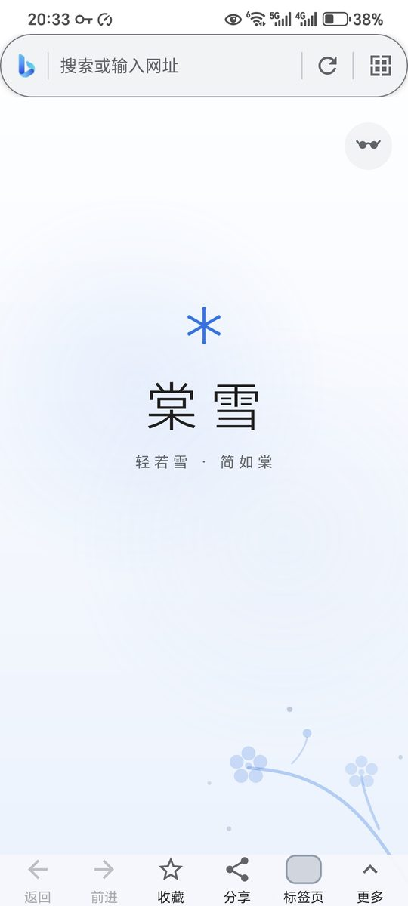
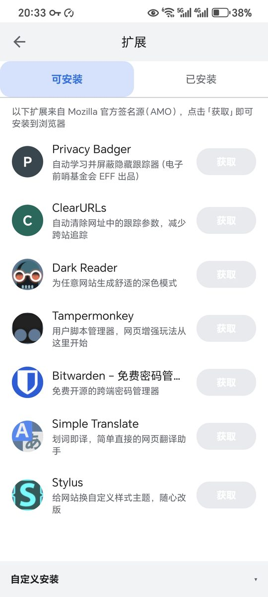
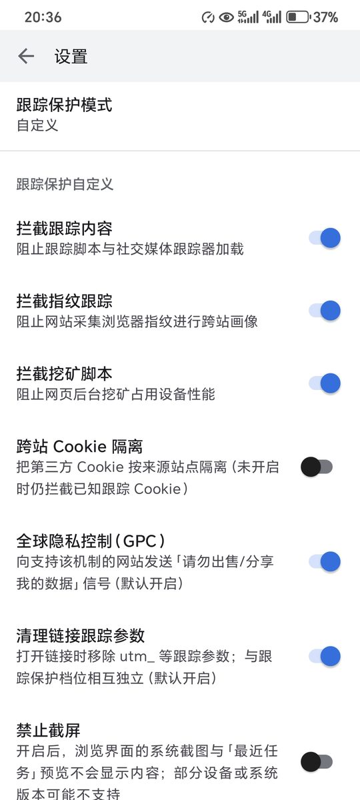

# 棠雪 / TangSnow

一款以隐私为第一优先、数据纯本地的 Android 浏览器，基于 Mozilla GeckoView 渲染内核。

[](LICENSE)
[](THIRD_PARTY_NOTICES.md)

## 特性

- **数据只保存在本机** —— 书签、历史、下载记录、主页定制全部本地存储，不上传
- **无账号、无统计、无广告、无追踪 SDK**
- **隐私防护** —— 跟踪保护（标准 / 严格 / 自定义 / 关闭）、跨站 Cookie 隔离、弹跳跟踪保护、指纹保护、URL 跟踪参数剥离、GPC 信号、无痕浏览
- **权限极简** —— 只需「网络」与「相机（扫码时按需）」两项
- **Mozilla 内核** —— GeckoView 155，与 Firefox 同源的 Gecko 引擎
- **扩展支持** —— 浏览 Mozilla 官方扩展目录（AMO），支持导入官方签名的 `.xpi`
- **日常功能** —— 多标签网格、画中画、页内查找、保存为 PDF、扫码、自定义搜索引擎、中文 IDN 域名
- **界面** —— 中文 / English，浅色 / 深色 / 跟随系统

## 截图

<table>
  <tr>
    <td align="center" width="33%">
      <br>
      <sub>主页</sub>
    </td>
    <td align="center" width="33%">
      <br>
      <sub>扩展目录（Mozilla 官方源）</sub>
    </td>
    <td align="center" width="33%">
      <br>
      <sub>跟踪保护</sub>
    </td>
  </tr>
</table>

## 下载

前往 **[Releases](https://github.com/Tan-Sno/TangSnow/releases/latest)** 下载 APK。

| 文件 | 适用设备 |
|---|---|
| `app-arm64-v8a-release.apk` | 现代手机（绝大多数设备，**推荐**） |
| `app-armeabi-v7a-release.apk` | 较老的 32 位设备 |
| `app-x86_64-release.apk` | 模拟器 / 少数 x86 设备 |

三个文件内容相同，仅 CPU 架构不同；不确定选哪个就下载 `arm64-v8a`。

要求 Android 8.0（API 26）及以上。安装前请在系统设置中允许「安装未知来源应用」。

### 从 2.0.x 升级？

**2.1.0 起应用标识已变更**（`com.tangsnow.tangsnow` → `io.github.tan_sno.tangsnow`），
因此新版**无法直接覆盖安装**在旧版之上 —— 系统会把它识别为一个新应用。

不必先卸载：两个版本可以**并存**。建议先装上新版、确认一切正常，再自行卸载旧版。
需要注意的是，旧版的书签、历史记录与各项设置**不会自动迁移**，需要在新版中重新配置。

每个版本的具体变更与安装要求，都写在对应的 Release 页面上。

## 隐私

- 不需要账号，没有云端账户；卸载即完成数据删除
- 除您主动访问的网站外，应用只访问以下三个外部服务，用途各自单一：
  - `addons.mozilla.org`：扩展目录、图标与扩展包（Mozilla 官方）
  - Mozilla 官方名单服务（`shavar.services.mozilla.com`）：跟踪保护名单在本机更新
  - `api.github.com`：**仅当您点击「设置 → 检查更新」时**读取公开的版本信息（版本号与更新说明）。
    该请求只读公开数据，不携带任何设备标识、账号或浏览记录，也**不会在后台自动发起**
- 内核「安全浏览」（钓鱼 / 恶意软件）的**远程查询已关闭**，不会把访问的网址发送给第三方
- 崩溃日志只写入本机，可在应用内查看或删除，不会上传
- 权限：`INTERNET`、`CAMERA`（按需申请），加上渲染内核自身声明的三项普通权限
  （网络状态 / 唤醒锁 / 音频设置）。安装后可在系统「应用信息 → 权限」中核对
- 另有一项 `DYNAMIC_RECEIVER_NOT_EXPORTED_PERMISSION`：由 AndroidX 自动生成的应用自签权限，
  用于阻止外部应用调用本应用内部的动态广播接收器。它不涉及任何数据访问，也不会出现在
  系统设置的可授权列表中。用 `aapt dump permissions` 之类的工具扫描时会看到它，特此说明

完整说明见[隐私政策](docs/PRIVACY.md)与[用户协议](docs/TERMS.md)。

## 已知限制

- 精选扩展目录只收录隐私保护与工具类扩展，不内置也不推荐任何广告拦截类扩展

## 从源码构建

要求：

- **JDK 25** —— Gradle 守护进程按 `gradle/gradle-daemon-jvm.properties` 固定使用该版本；
  本机若未安装，Gradle 会自动下载。产物字节码目标为 Java 17。
- Android SDK `platforms;android-37`（API 37，minor level 2）

```bash
./gradlew :app:assembleDebug      # 构建 debug 包
./gradlew :app:lintDebug          # 静态检查
./gradlew :app:testDebugUnitTest  # 单元测试
```

正式包请用 `:app:assembleRelease`。GeckoView 原生库（`libxul.so` 等 `.so`，未压缩存储）约占包体
86%，因此按 ABI 独立分包（`arm64-v8a` / `armeabi-v7a` / `x86_64`），不产出 universal APK；各包的
`versionCode` 互不相同，以便在同一设备上切换架构安装。签名凭据不放仓库，由本地未跟踪的
`keystore.properties` 提供（缺少该文件时 release 会回退 debug 证书并打印警告，产物不可分发）。

## 参与贡献

欢迎提交 Issue 与 Pull Request，请先阅读 [CONTRIBUTING.md](CONTRIBUTING.md)。

参与本项目即表示你同意遵守[社区行为准则](CODE_OF_CONDUCT.md)。

## 安全

发现安全漏洞请**不要**通过公开 Issue 报告，改用
[私密漏洞报告入口](https://github.com/Tan-Sno/TangSnow/security/advisories/new)。
支持的版本范围与处理流程见 [SECURITY.md](SECURITY.md)。

## 许可证

应用自身代码采用 [Apache License 2.0](LICENSE)。

渲染内核 Mozilla GeckoView 采用 Mozilla Public License 2.0。第三方组件的清单、版本、版权与商标声明见
[THIRD_PARTY_NOTICES.md](THIRD_PARTY_NOTICES.md)（其中包含 MPL 2.0 §3.2 要求的源码获取途径）。

棠雪为原创品牌，**并非 Mozilla 产品，与 Firefox 无隶属关系**。
